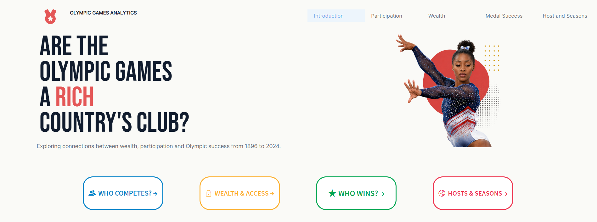
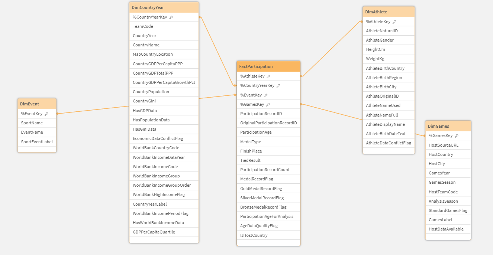
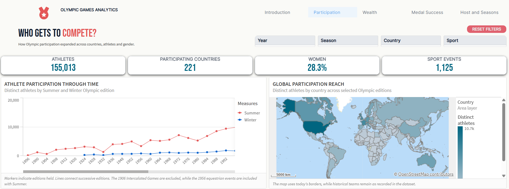
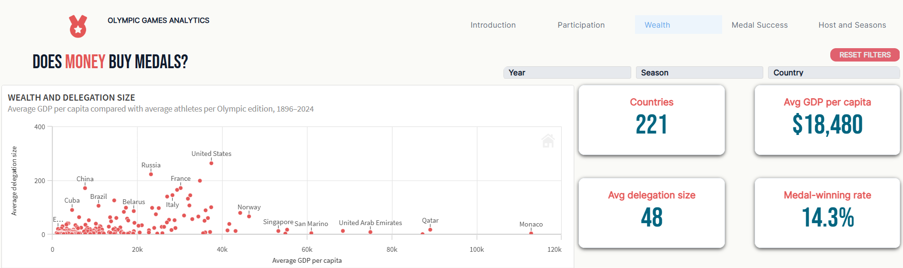
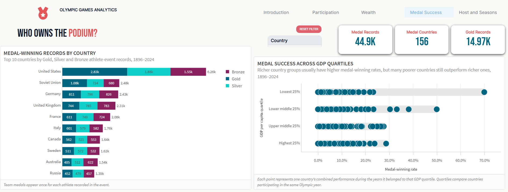
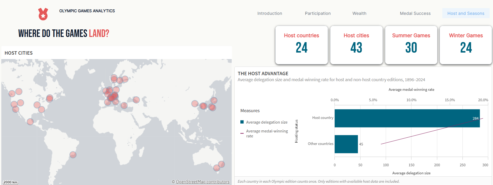

# Olympic Games & Global Inequality

<p align="center">
  
</p>

<p align="center">
  <strong>An interactive analysis of wealth, participation and Olympic success from 1896 to 2024.</strong>
</p>

<p align="center">
  
  
  
  
</p>

---

## Project Overview

This project investigates the question:

> **Are the Olympic Games a rich country’s club?**

The analysis combines 315,760 athlete-event records with economic, demographic, income-classification and Olympic host data.

The result is a five-sheet Qlik Sense application examining participation, wealth, medal success and hosting patterns across 128 years of Olympic history.

## Dashboard Sections

| Section          | Analysis                                                        |
| ---------------- | --------------------------------------------------------------- |
| Introduction     | Central analytical question and dashboard navigation            |
| Participation    | Changes in athletes, countries, events and gender participation |
| Wealth           | GDP per capita, delegation size and medal-winning rates         |
| Medal Success    | Leading countries and comparisons across GDP quartiles          |
| Host and Seasons | Host advantage, hosting concentration and seasonal differences  |

## Data Architecture

The application uses a star schema with a central participation fact table and four supporting dimensions.

<p align="center">
  
</p>

* `FactParticipation` — one record per athlete-event participation
* `DimAthlete` — athlete identity and demographic attributes
* `DimGames` — Olympic edition, season and host information
* `DimEvent` — sport and event information
* `DimCountryYear` — economic and demographic indicators by country and year

## Technical Implementation

The Qlik load script is organised into separate source, staging, transformation and modelling sections.

Key implementation work includes:

* Cleaning and standardising Olympic source data
* Creating stable keys with `AutoNumberHash128`
* Integrating Olympic host and World Bank income data
* Mapping historical country names and team codes
* Separating repeated economic information into a country-year dimension
* Calculating GDP-per-capita quartiles within each Olympic year
* Creating data-availability and conflict-detection flags
* Handling the split 1956 Summer and Equestrian Olympic host records
* Creating reusable medal, host and participation indicators
* Removing staging and temporary tables after building the final model

[View the complete Qlik load script](src/olympic-load-script.qvs)

## Selected Findings

* Wealth had a positive but limited relationship with Olympic medal success.
* The observed GDP–success correlation was `0.26`.
* High-income countries accounted for a larger share of medal-winning records in the Winter Games than in the Summer Games.
* Host countries generally entered larger delegations and achieved stronger medal-winning rates than non-host countries.
* Olympic participation expanded substantially, although representation remained uneven between countries and genders.

## Dashboard Preview

### Participation and Global Reach

<p align="center">
  
</p>

### Wealth and Delegation Size

<p align="center">
  
</p>

### Medal Success

<p align="center">
  
</p>

### Hosts and Seasons

<p align="center">
  
</p>

## Data Sources

The analysis combines:

* Historical Olympic athlete and event data
* GDP, population and Gini indicators
* Olympic host-country and host-city records
* Historical World Bank income classifications

[Read the data-source and methodology notes](docs/data-sources.md)

The source datasets are not redistributed in this repository.

## Repository Structure

```text
olympic-games-analytics/
├── assets/
│   ├── dashboards/
│   └── data-model.png
├── docs/
│   └── data-sources.md
├── src/
│   └── olympic-load-script.qvs
└── README.md
```

---

## Author

**Vesta Revinskaitė**

[GitHub](https://github.com/vesta0313) · [LinkedIn](https://www.linkedin.com/in/vesta-revinskaite/)
